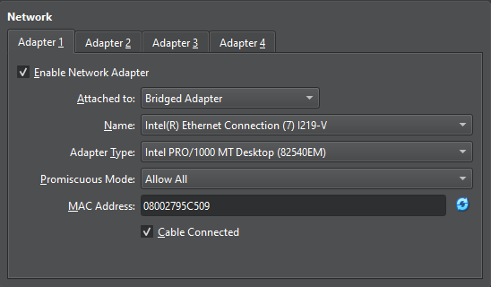
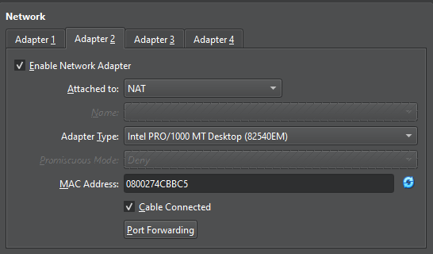

## Prerequisites 
- Downloaded and installed Virtualbox [Download](https://www.virtualbox.org/wiki/Downloads)
- Greenbone OpenVAS OVA downloaded [Download](https://www.greenbone.net/en/greenbone-free/)
- Windows 10 ISO downloaded [Download](https://www.microsoft.com/en-us/software-download/windows10) 
## Setting up Greenbone OpenVAS VM
- Start VirtualBox
- Select *File > Import Appliance*
	- Click on  and navigate to and select the downloaded Greenbone OpenVAS OVA file
	- Click Finish
- Click Settings
	- *Network > Adapter 1 > Enable Network Adapter > Attached to: Bridged Adapter > Promiscuous Mode: Allow All*
		- This allows the VM to communicate with other VMs that have Bridge Adapter enabled (same subnet)
		- 
	- *Network > Adapter 2 > Enable Network Adapter > Attached to: NAT*
		- This allows the VM to communicate to the internet through the host machine's IP
		- 
	- Click *OK* to apply settings
- Click Start and log in
	- Username: admin
	- Password: admin
	- When prompted to complete setup, select *Yes*
	- When Prompted to create a web admin, select *Yes*
	- When prompted to create new admin, create an Account name and Password
	- Select *OK*
	- When prompted to Upload Subscription Key Now, select *Skip > OK*
- Once in the main Greenbone OS Administration menu, we need to update the feed.
	- 
- Select *Maintenance > Feed > Update*
- The feed update will take up to 30-60 minutes. You can check the progress by going to *About* in the main menu. If it is updating still, it will say "The system operation 'Update Feed' is running currently"
- 

## Setting up Windows 10 VM and enabling vulnerabilities
- Start VirtualBox
- Select *Machine > New*
	- *Name and Operating System*
		- Name: Windows10-VM
		- Under ISO Image, click on  and navigate to and select the downloaded Windows 10 ISO file
			- 
	- Click on *Unattended Install*
		- Type in a Username and Password
	- Click on *Hardware*
		- Base Memory: 4096 MB or more
		- Processors: 2 CPU or more
	- Click *Hard Disk*
		- Hard Disk Size: at least 10 GB, no more than 15 GB
	- Click Finish
- Note: Windows 10 VM will automatically start. Let it start and if it gives you an error "*Windows cannot read the \<ProductKey> setting from the unattend answer file.*", follow the instructions below. Otherwise, skip these steps.
	- Click *OK* to close dialogue
	- On the Virtual Machine menu bar, click *File > Close... > Power off the machine > OK*
	- On Oracle VirtualBox Manager, select the Windows10-VM, then click Settings
	- Under *System > Boot Order*, uncheck Floppy
	- Under *Storage > Devices*, select the item under *Controller: Floppy*, then click Remove Attachment 
	- Click *OK*
- On Oracle VirtualBox Manager, click Settings
	- *Network > Adapter 1 > Enable Network Adapter > Attached to: Bridged Adapter > Promiscuous Mode: Allow All*
		- This allows the VM to communicate with other VMs that have Bridge Adapter enabled (same subnet)
		- 
	- *Network > Adapter 2 > Enable Network Adapter > Attached to: NAT*
		- This allows the VM to communicate to the internet through the host machine's IP
		- 
	- Click *OK* to apply settings
- Click Start and log in

## Configuring unauthenticated scan in OpenVAS

## Running unauthenticated scan against Windows 10 VM

## Observing unauthenticated scan results

## Configuring authenticated scan in OpenVAS with credentials

## Reconfiguring Windows 10 VM to allow authenticated scan

## Running authenticated scan against Windows 10 VM

## Observing authenticated scan results

## Remediating software vulnerabilities

## Further Recommendations