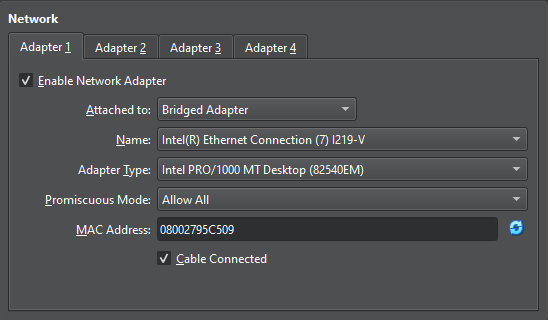
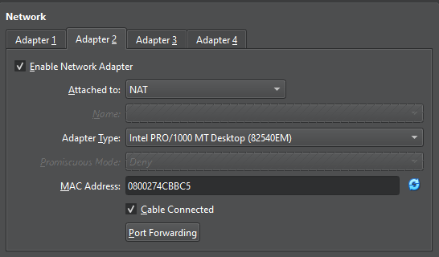
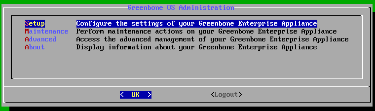
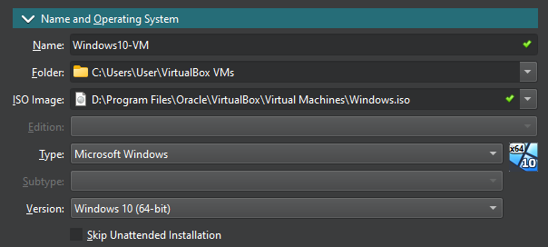

# Vulnerability Scanning & Remediation With OpenVAS Using VirtualBox

In this homelab, I set up a virtualized environment using Oracle VirtualBox, deploying an OpenVAS Vulnerability Management Scanner VM and a vulnerable Windows 10 VM. I simulated a security testing scenario by intentionally installing outdated software on the Windows 10 VM and performing both unauthenticated and credentialed vulnerability scans with OpenVAS. I then analyzed the scan results, remediated the identified vulnerabilities, and verified improvements through subsequent rescans.

This lab provided hands-on experience in vulnerability scanning, system hardening, and patch management.

- Set up a virtualized homelab environment using Oracle VirtualBox, deploying an OpenVAS Vulnerability Management Scanner VM and a vulnerable Windows 10 VM.  
- Developed a vulnerable Windows 10 VM by intentionally installing outdated software and disabling security controls to simulate common real-world vulnerabilities.  
- Performed unauthenticated and credentialed vulnerability scans using OpenVAS, comparing results between both methods to identify security gaps.  
- Analyzed and documented scan results, highlighting the differences in findings between unauthenticated and credentialed scans, and assessed the impact of vulnerabilities.  
- Remediated identified vulnerabilities through system patching, configuration changes, and security updates, then verified successful remediation by rescanning with OpenVAS.  
- Created a comprehensive list of vulnerabilities and remediation steps, simulating realistic vulnerability remediation scenarios for improving system security.

**Skills:**
Vulnerability Scanning · OpenVAS Configuration · Unauthenticated and Authenticated Scanning · Vulnerability Remediation · System Hardening · Network Security · Windows Firewall · Security Documentation · Cyber Risk Management · Penetration Testing · Virtualization

---

## Prerequisites 
- Downloaded and installed VirtualBox [Download](https://www.virtualbox.org/wiki/Downloads)
- Greenbone OpenVAS OVA downloaded [Download](https://www.greenbone.net/en/greenbone-free/)
- Windows 10 ISO downloaded [Download](https://www.microsoft.com/en-us/software-download/windows10) 
## Setting up Greenbone OpenVAS VM
- Start VirtualBox
- Select *File > Import Appliance*
	- Click on  and navigate to and select the downloaded Greenbone OpenVAS OVA file
	- Click Finish
- Click Settings
	- *Network > Adapter 1 > Enable Network Adapter > Attached to: Bridged Adapter > Promiscuous Mode: Allow All*
		- This allows the VM to communicate with other VMs that have Bridge Adapter enabled (same subnet)
		- 
	- *Network > Adapter 2 > Enable Network Adapter > Attached to: NAT*
		- This allows the VM to communicate to the internet through the host machine's IP
		- 
	- Click *OK* to apply settings
- Click Start and log in
	- Username: admin
	- Password: admin
	- When prompted to complete setup, select *Yes*
	- When Prompted to create a web admin, select *Yes*
	- When prompted to create new admin, create an Account name and Password
	- Select *OK*
	- When prompted to Upload Subscription Key Now, select *Skip > OK*
- Once in the main Greenbone OS Administration menu, we need to update the feed.
	- 
- Select *Maintenance > Feed > Update*
	- The feed update will take up to 30-60 minutes. You can check the progress by going to *About* in the main menu. If it is updating still, it will say "System Status: The system operation 'Update Feed' is running currently"
	- Once it is completed, it will say "System Status: No system operation is running currently."
- You can shutdown OpenVAS VM by selecting *Maintenance > Power > Shutdown*
- Note: Now would be a good time to take a snapshot of the base VM to revert back to if you accidentally misconfigure something.
	- On the Oracle VirtualBox Manager, select the VM to take a snapshot of.
	- Click on 
		- Snapshot Name: Baseline
		- Snapshot Description: Fresh installation
## Setting up Windows 10 VM
- Start VirtualBox
- Select *Machine > New*
	- *Name and Operating System*
		- Name: Windows10-VM
		- Under ISO Image, click on  and navigate to and select the downloaded Windows 10 ISO file
			- 
	- Click on *Unattended Install*
		- Type in a Username and Password
	- Click on *Hardware*
		- Base Memory: 4096 MB or more
		- Processors: 2 CPU or more
	- Click *Hard Disk*
		- Hard Disk Size: at least 10 GB, no more than 15 GB
	- Click Finish
- Note: Windows 10 VM will automatically start. Let it start and if it gives you an error "*Windows cannot read the \<ProductKey> setting from the unattend answer file.*", follow the instructions below. Otherwise, skip these steps.
	- Click *OK* to close dialogue
	- On the Virtual Machine menu bar, click *File > Close... > Power off the machine > OK*
	- On Oracle VirtualBox Manager, select the Windows10-VM, then click Settings
	- Under *System > Boot Order*, uncheck Floppy
	- Under *Storage > Devices*, select the item under *Controller: Floppy*, then click Remove Attachment 
	- Click *OK*
- On Oracle VirtualBox Manager, click Settings
	- *Network > Adapter 1 > Enable Network Adapter > Attached to: Bridged Adapter > Promiscuous Mode: Allow All*
		- This allows the VM to communicate with other VMs that have Bridge Adapter enabled (same subnet)
		- 
	- *Network > Adapter 2 > Enable Network Adapter > Attached to: NAT*
		- This allows the VM to communicate to the internet through the host machine's IP
		- 
	- Click *OK* to apply settings
- Click Start to power up Windows 10 VM
- Set up Windows 10 installation
	- Click *Next > Install Now > I don't have a product key*
	- For the operating system selection, select *Windows 10 Pro*, and click *Next*
	- Check *I accept the license terms > Next*
	- Click *Custom: Install Windows only (advanced)*
	- Click *Drive 0 Unallocated Space > New > Apply > OK*
	- Click *Drive 0 Partition 2 > Next*
	- Let Windows 10 install on the virtual machine
- After Windows 10 is installed, go through basic setup
	- Click *Yes > Yes > Skip second keyboard layout > Set up for personal use > Next > Offline account > Limited experience*
	- Go through the next few screens of setting up your Username, Password, and security questions.
	- Click *Not now > Accept > Skip > Not now*
- After you get past all the menus, you can shutdown the Windows10 VM
	- Click on *Start > Power > Shutdown*
- Note: Now would be a good time to take a snapshot of the base VM to revert back to if you accidentally misconfigure something.
	- On the Oracle VirtualBox Manager, select the VM to take a snapshot of.
	- Click on 
		- Snapshot Name: Baseline
		- Snapshot Description: Fresh installation

## Enabling vulnerabilities

## Configuring unauthenticated scan in OpenVAS

## Running unauthenticated scan against Windows 10 VM

## Observing unauthenticated scan results

## Configuring authenticated scan in OpenVAS with credentials

## Reconfiguring Windows 10 VM to allow authenticated scan

## Running authenticated scan against Windows 10 VM

## Observing authenticated scan results

## Remediating software vulnerabilities

## Further Recommendations